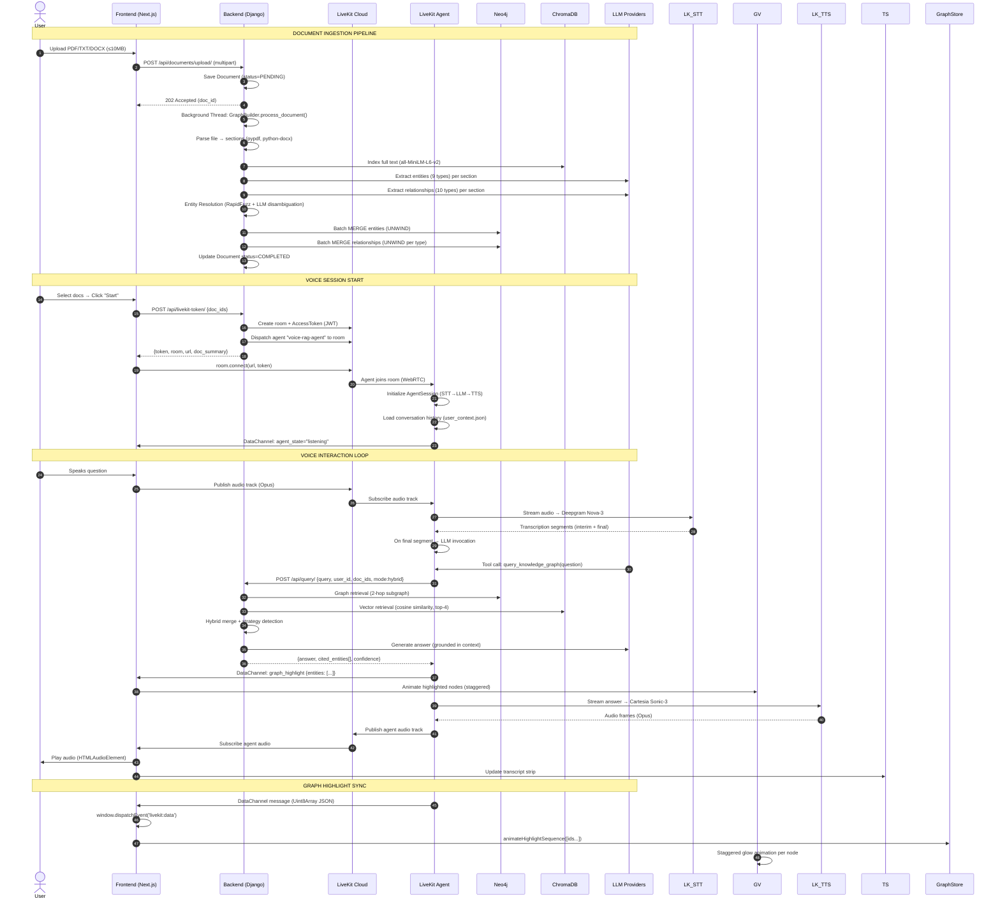
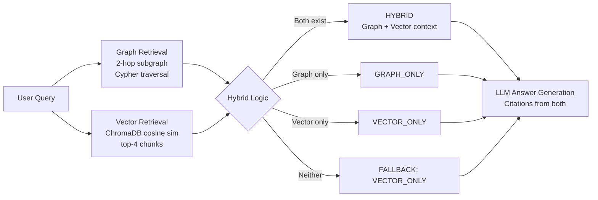
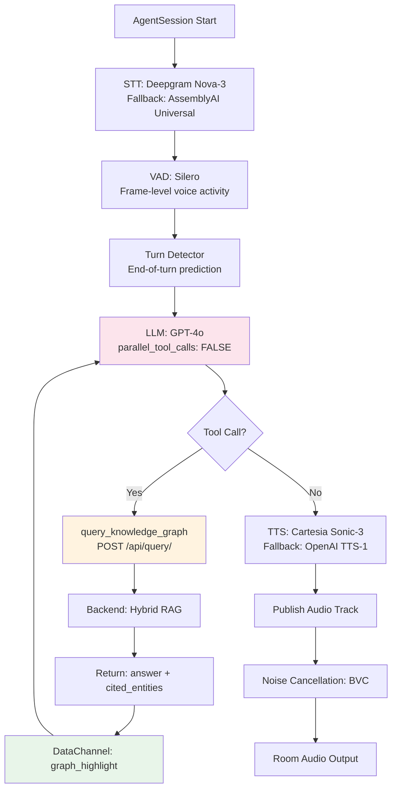
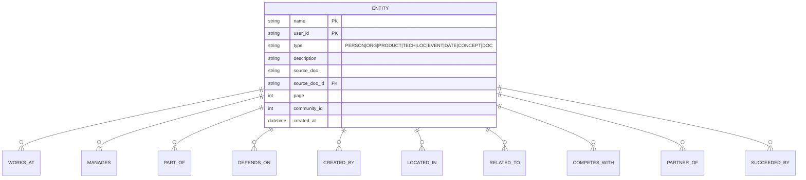

# Voice-Graph-Rag — Complete Technical Specification (AGENTS.md)

> **Project:** Voice-Graph-Rag — Voice-enabled VoiceRAG with LiveKit + VRM Avatar
> **Organization:** Excellence Technologies Pvt Ltd
> **Phase:** Phase 2 — LangChain & Advanced RAG + Voice Agent Integration
> **Version:** 1.0 (Comprehensive Spec)

---

## 📐 SYSTEM ARCHITECTURE OVERVIEW

```mermaid
flowchart TB
    subgraph Frontend["🖥️ FRONTEND (Next.js 14 + React 18 + TypeScript + Tailwind)"]
        direction TB
        VRP[Voice RAG Page\n/voice-rag]
        AV[AvatarPanel\nVRMScene.tsx\n3D VRM Avatar]
        VC[VoiceControls.tsx\nLiveKit Connection]
        GV[GraphVisualization.tsx\nreact-force-graph-2d]
        TS[TranscriptStrip.tsx]
        CHS[ChatHistorySidebar.tsx]
        MDS[MultiDocSelector.tsx]
    end

    subgraph Backend["⚙️ BACKEND (Django 4.2 + DRF + JWT)"]
        direction TB
        LKT[LiveKitTokenView\n/api/livekit-token/]
        QV[QueryView\n/api/query/]
        GV_API[GraphDataView\n/api/graph/]
        MH[MultiHopQueryView\n/api/query/multihop/]
        CD[CommunityListView\n/api/graph/communities/]
        DU[DocumentUploadView\n/api/documents/upload/]
        GB[GraphBuilder.py\nIngestion Pipeline]
        RC[RAGChain.py\nAnswer Generation]
    end

    subgraph LiveKit["🎙️ LIVEKIT CLOUD / SELF-HOSTED"]
        direction TB
        LK_Room[LiveKit Room\nuser-{id}-doc-{id}-voice-rag]
        LK_Agent[LiveKit Agent\nagent/agent.py\nVoice RAG Agent]
        LK_STT[STT: Deepgram Nova-3\nFallback: AssemblyAI]
        LK_LLM[LLM: GPT-4o\nParallel Tools: OFF]
        LK_TTS[TTS: Cartesia Sonic-3\nFallback: OpenAI TTS-1]
        LK_VAD[VAD: Silero]
        LK_TD[Turn Detector]
        LK_NC[Noise Cancellation: BVC]
    end

    subgraph DataStores["💾 DATA STORES"]
        Neo4j[(Neo4j 5.12\nGraph DB\nbolt://localhost:7687)]
        ChromaDB[(ChromaDB\nVector Store\nLocal: ./chroma_db)]
        DjangoDB[(SQLite / PostgreSQL\nDjango Models)]
    end

    subgraph LLMProviders["🤖 LLM PROVIDERS (Fallback Chain)"]
        Groq[Groq: Llama-3.3-70B]
        OpenAI[OpenAI: GPT-4o-mini]
        NVIDIA[NVIDIA NIM: Llama-3.1-70B]
        Gemini[Google: Gemini 1.5 Flash]
    end

    %% Connections
    VRP -->|REST API (JWT)| Backend
    VRP -->|WebSocket (LiveKit)| LK_Room
    LK_Room <-->|Audio/DataChannel| LK_Agent
    LK_Agent -->|STT| LK_STT
    LK_Agent -->|LLM| LK_LLM
    LK_Agent -->|TTS| LK_TTS
    LK_Agent -->|VAD| LK_VAD
    LK_Agent -->|Turn Detection| LK_TD
    LK_Agent -->|Noise Cancel| LK_NC
    LK_Agent -->|HTTP Query| QV
    LK_Agent -->|DataChannel: graph_highlight| GV
    Backend -->|Cypher| Neo4j
    Backend -->|Vectors| ChromaDB
    Backend -->|ORM| DjangoDB
    Backend -->|LLM Calls| LLMProviders
    GB -->|Ingestion| Neo4j
    GB -->|Vectors| ChromaDB
    RC -->|Retrieval| Neo4j
    RC -->|Retrieval| ChromaDB
    RC -->|LLM| LLMProviders
```

---

## 🏗️ COMPLETE TECH STACK

| Layer | Technology | Version | Purpose |
|-------|------------|---------|---------|
| **Frontend Framework** | Next.js | 14 (App Router) | React SSR/CSR hybrid |
| **Language** | TypeScript | 5.x | Type safety |
| **Styling** | Tailwind CSS | 3.4 | Utility-first styling |
| **State Management** | Zustand | 4.x | Global stores (auth, docs, graph, voice) |
| **Graph Visualization** | react-force-graph-2d | 1.27 | WebGL force-directed graph |
| **3D Avatar** | Three.js + @pixiv/three-vrm | r158 + 3.2 | VRM 0/1 avatar rendering |
| **Audio Analysis** | Web Audio API (AnalyserNode) | Native | FFT lip-sync |
| **Real-time Communication** | livekit-client | 2.x | WebRTC signaling + DataChannel |
| **Backend Framework** | Django | 4.2 LTS | REST API |
| **API Framework** | Django REST Framework | 3.14 | Serialization, auth, throttling |
| **Auth** | djangorestframework-simplejwt | 5.3 | JWT access/refresh tokens |
| **Graph Database** | Neo4j | 5.12 (Docker) | Property graph storage |
| **Vector Database** | ChromaDB | 0.4+ | Embedding storage & similarity search |
| **Embeddings** | sentence-transformers | all-MiniLM-L6-v2 | 384-dim embeddings |
| **LLM Orchestration** | LangChain | 0.1+ | Chains, prompts, fallbacks |
| **LLM Providers** | Groq, OpenAI, Google, NVIDIA | Latest | Multi-provider fallback |
| **Entity Extraction** | LLM Structured Output | Pydantic | 9 entity types, 10 rel types |
| **Fuzzy Matching** | RapidFuzz | 3.5 | Entity resolution |
| **LiveKit Server** | LiveKit Cloud / Self-hosted | 1.2+ | WebRTC SFU |
| **LiveKit Agents SDK** | livekit-agents | 1.0+ | Voice AI pipeline |
| **STT** | Deepgram Nova-3 / AssemblyAI | - | Streaming transcription |
| **TTS** | Cartesia Sonic-3 / OpenAI TTS-1 | - | Neural speech synthesis |
| **VAD** | Silero | 5.x | Voice activity detection |
| **Turn Detection** | LiveKit TurnDetector | - | End-of-turn prediction |
| **Noise Cancellation** | BVC (LiveKit) | - | Background noise removal |
| **Container Orchestration** | Docker Compose | 2.x | Multi-service deployment |

---

## 🔄 END-TO-END DATA FLOW



---

## 🧠 GRAPHRAG INGESTION PIPELINE (DETAIL)

```mermaid
flowchart TD
    A[Document Upload] --> B[Parse File → Sections/Pages]
    B --> C[ChromaDB: Index Full Text\n(all-MiniLM-L6-v2, 384-d)]
    B --> D[Parallel Section Processing\n(ThreadPoolExecutor, max_workers=2)]
    D --> E[Entity Extraction (LLM)\n9 Types: PERSON, ORG, PRODUCT,\nTECH, LOC, EVENT, DATE, CONCEPT, DOC]
    D --> F[Relationship Extraction (LLM)\n10 Types: WORKS_AT, MANAGES,\nPART_OF, DEPENDS_ON, CREATED_BY,\nLOCATED_IN, RELATED_TO, COMPETES_WITH,\nPARTNER_OF, SUCCEEDED_BY]
    E --> G[Entity Resolution\nRapidFuzz (token_set_ratio ≥ 90)\n+ LLM Disambiguation]
    F --> G
    G --> H[Batch Write to Neo4j\nUNWIND MERGE entities\nUNWIND MERGE relationships by type]
    H --> I[Document Summary (LLM)]
    I --> J[Status: COMPLETED\nentity_count, relationship_count]

    style A fill:#e8f5e9
    style J fill:#e8f5e9
    style C fill:#e3f2fd
    style H fill:#fff3e0
```

### Entity Types (9)
| # | Type | Example | Description |
|---|------|---------|-------------|
| 1 | PERSON | "John Smith" | Human individuals |
| 2 | ORGANIZATION | "Google" | Companies, institutions |
| 3 | PRODUCT | "ChatGPT" | Software, hardware products |
| 4 | TECHNOLOGY | "React" | Frameworks, languages, tools |
| 5 | LOCATION | "San Francisco" | Cities, countries, venues |
| 6 | EVENT | "WWDC 2024" | Conferences, launches |
| 7 | DATE | "January 2024" | Temporal references |
| 8 | CONCEPT | "microservices" | Abstract ideas, methodologies |
| 9 | DOCUMENT | "Annual Report 2024" | Source document references |

### Relationship Types (10)
| # | Type | Direction | Example |
|---|------|-----------|---------|
| 1 | WORKS_AT | Person → Organization | Alice → Google |
| 2 | MANAGES | Person → Person/Project | Bob → Alice |
| 3 | PART_OF | Component → System | Payment Service → Platform |
| 4 | DEPENDS_ON | Service → Service | Auth → User DB |
| 5 | CREATED_BY | Product → Person | React → Jordan Walke |
| 6 | LOCATED_IN | Entity → Location | HQ → Mountain View |
| 7 | RELATED_TO | Entity ↔ Entity | General association |
| 8 | COMPETES_WITH | Org ↔ Org | Google ↔ Microsoft |
| 9 | PARTNER_OF | Org ↔ Org | Microsoft ↔ OpenAI |
| 10 | SUCCEEDED_BY | Event/Version → Event/Version | v1 → v2 |

---

## 🔍 RETRIEVAL MODES & HYBRID STRATEGY



### Retrieval Strategies
| Mode | Endpoint | Use Case |
|------|----------|----------|
| **Hybrid** (default) | `POST /api/query/ {mode: "hybrid"}` | Best overall — combines structured graph paths + unstructured text |
| **Graph Only** | `POST /api/query/graph-only/` | Relationship traversal, multi-hop reasoning |
| **Vector Only** | `POST /api/query/vector-only/` | Conceptual/thematic queries, fuzzy recall |
| **Compare All** | `POST /api/query/compare/` | Side-by-side evaluation |

### Graph Retrieval Details
- **Depth**: 2 hops (configurable up to 10)
- **Filtering**: By `document_ids` (source_doc_id property)
- **Output**: Formatted entity list + relationship paths + descriptions
- **Entity Highlighting**: Returns `cited_entities: [{id, name, score}]` for frontend sync

### Vector Retrieval Details
- **Embedding**: `sentence-transformers/all-MiniLM-L6-v2` (384-dim)
- **Similarity**: Cosine distance
- **Top-K**: 4 chunks (configurable)
- **Chunk Size**: ~1500 chars per section

---

## 🎙️ LIVEKIT VOICE AGENT ARCHITECTURE

### Agent Pipeline (`agent/agent.py`)



### Key Agent Configuration

| Component | Configuration | Rationale |
|-----------|---------------|-----------|
| **STT** | Deepgram Nova-3 (primary), AssemblyAI Universal (fallback) | Best accuracy + streaming |
| **LLM** | GPT-4o, `parallel_tool_calls=False` | Forces sequential tool→answer flow |
| **TTS** | Cartesia Sonic-3 (primary), OpenAI TTS-1 (fallback) | Low latency, natural prosody |
| **VAD** | Silero (5.x) | Lightweight, accurate |
| **Turn Detection** | LiveKit TurnDetector | Learned end-of-turn model |
| **Noise Cancellation** | BVC (LiveKit) | Real-time background removal |
| **Preemptive Generation** | `enabled: false` for RAG mode, `true` for chat | Prevents hallucination before tool returns |
| **History Persistence** | `user_context.json` (async file lock) | Cross-session memory |

### Agent Tool: `query_knowledge_graph`

```python
@llm.function_tool(description="MANDATORY: Query VoiceRAG knowledge base...")
async def query_knowledge_graph(self, question: str) -> str:
    # Payload sent to backend
    payload = {
        "query": question,
        "document_ids": self.doc_ids,      # From room metadata
        "user_id": self.user_id,
        "mode": "hybrid"
    }
    
    # Response handling
    answer = data.get("answer", "No answer found.")
    cited_entities = data.get("cited_entities", [])
    
    # Publish to frontend via DataChannel
    if cited_entities:
        highlight_payload = json.dumps({
            "type": "graph_highlight",
            "entities": cited_entities  # [{id, name, score}]
        })
        await self.room.local_participant.publish_data(
            highlight_payload.encode("utf-8"),
            reliable=True
        )
    
    return answer  # Spoken by TTS
```

### Room Metadata Schema (JWT Token)

```json
{
  "user_id": "123",
  "doc_ids": "[\"doc-uuid-1\", \"doc-uuid-2\"]",
  "doc_name": "Document A, Document B",
  "doc_summary": "Summary of Document A\n\n---\nSummary of Document B"
}
```

### Room Naming Convention
```
user-{user_id}-doc-{doc_id}-{random8}-voice-rag          # Single doc
user-{user_id}-multi-{md5hash(doc_ids)}-{random8}-voice-rag  # Multi-doc
```

---

## 🤖 VRM AVATAR SYSTEM (DEEP DIVE)

### Architecture: `frontend/src/components/voice/VRMScene.tsx`

```mermaid
flowchart TD
    A[VRMScene Component Mount] --> B[Three.js Scene Init\nRenderer, Camera, Lights]
    B --> C[Load VRM Model\nGLTFLoader + VRMLoaderPlugin]
    C --> D[Animation Loop (60 FPS)\nrequestAnimationFrame]
    D --> E[State Machine\nagentState: idle/listening/thinking/speaking]
    E --> F[Spring Physics Engine\nSpringFloat class]
    F --> G[Bone Animation\nVRM Humanoid API]
    G --> H[Expression Manager\nVRM BlendShapes]
    H --> I[Audio Reactive Lip-Sync\nFFT Analysis via Web Audio API]
    I --> J[Render Frame]
    J --> D

    subgraph AnimationSystems["Animation Systems"]
        F1[Head Tracking\nSaccadic gaze + cognitive lock]
        F2[Spine Breathing\nCounter-rotation + micro-tremor]
        F3[Weight Shifting\nHip sway 8-sec cycle]
        F4[Arm Kinematics\nFK + whip effect on lower arm]
        F5[Blinking\nAsymmetric, 3-8 sec intervals]
        F6[Emotional Matrix\nhappy/angry/relaxed blendshapes]
        F7[Visemes\naa/oh/ee from FFT bands]
    end
```

### Spring Physics Engine (`SpringFloat` class)

```typescript
class SpringFloat {
  value: number;      // Current value
  target: number;     // Target value
  velocity: number;   // Current velocity
  tension: number;    // Spring stiffness (40-200)
  friction: number;   // Damping (0.6-0.9)
  
  update(delta: number): number {
    const diff = this.target - this.value;
    const force = diff * this.tension;
    this.velocity += force * delta;
    this.velocity *= this.friction;
    this.value += this.velocity * delta;
    return this.value;
  }
}
```

### Bone Mapping (VRM Humanoid Standard)

| Bone Node | Animation Purpose | Spring Config |
|-----------|-------------------|---------------|
| `hips` | Weight shifting, breathing counter-balance | tension: 20, friction: 0.9 |
| `spine` | Breathing, laughter convulsion, creepy lean | tension: 40/200, friction: 0.8 |
| `chest` | Extra breathing amplitude | - |
| `neck` | Micro-tremor (alive feeling) | - |
| `head` | Gaze tracking, nodding, laughter throw-back | tension: 60, friction: 0.85 |
| `rightUpperArm` / `leftUpperArm` | Gesturing, emphasis chops | tension: 50/150, friction: 0.75 |
| `rightLowerArm` | FK whip delay (follows upper arm velocity) | - |

### Expression BlendShapes (VRM 0.x / 1.0)

| BlendShape | Range | Trigger |
|------------|-------|---------|
| `happy` | 0.0 - 1.0 | Speaking (0.1), Listening (0.6), Big Laugh (1.0) |
| `angry` | 0.0 - 0.45 | Creepy stare (0.45), brow furrow |
| `relaxed` | 0.0 - 0.5 | Idle baseline (0.5) |
| `blink` | 0.0 - 1.0 | Asymmetric (R lags 5%), 160ms duration |
| `aa` (jaw drop) | 0.0 - 1.0 | FFT mids (650-1500Hz) |
| `oh` (mouth round) | 0.0 - 1.0 | FFT lows (180-550Hz) |
| `ee` (lips wide) | 0.0 - 1.0 | FFT highs (1500-3700Hz) |

### State-Driven Behavior Matrix

| Agent State | Head | Spine | Arms | Eyes | Blink | Expression |
|-------------|------|-------|------|------|-------|------------|
| **idle** | Saccadic gaze (1.5-4.5s) | Breathing (1.5s) | Sway (0.6s) | Random targets | Normal (3-8s) | relaxed=0.5, happy=0.1 |
| **listening** | Attentive nod (+0.04 rad) | Slight lean forward | Relaxed | Lock on camera | Normal | happy=0.6 |
| **thinking** | Kubrick stare (head down +0.15) | Lean in (+0.08) | Frozen | Lock on camera | **DISABLED** | happy=1.0, angry=0.45 |
| **speaking** | Subtle nod | Breathing + gesture sync | Conversational gesture (2Hz) | Saccadic | Normal | happy=0.1, relaxed=0.5 |
| **speaking (loud >0.8)** | Throw back (-0.2) | Violent convulsion (25Hz) | Hands to belly | Squeeze shut | Forced (1.0) | happy=1.0 |
| **speaking (derivative >0.15)** | - | - | **Emphatic chop** (tension=150) | - | - | - |

### Lip-Sync: FFT-Based Viseme Extraction (`useAvatarLipSync.ts`)

```typescript
// Frequency bin mapping (48kHz sample rate → ~93.75 Hz/bin)
const analyser = audioCtx.createAnalyser();
analyser.fftSize = 512;  // 256 bins
analyser.smoothingTimeConstant = 0.5;

// Band definitions
const ohBins = [2, 3, 4, 5, 6];      // ~180-550 Hz  → mouth rounding
const aaBins = [7, 8, 9, 10, 11, 12, 13, 14, 15, 16];  // ~650-1500 Hz → jaw drop
const eeBins = [17, 18, ..., 40];    // ~1500-3700 Hz → lip spreading

// Normalization (empirical scaling)
oh = min((sum/5) / 255 * 2.0, 1.0);
aa = min((sum/10) / 255 * 2.0, 1.0);
ee = min((sum/24) / 255 * 2.5, 1.0);

// Derivative for "hard" emphasis detection
derivative = max(volume - prevVolume, 0);
```

### VRM Model Loading & Hot-Swap

```typescript
// AvatarPanel.tsx — dropdown selector
const avatars = [
  { id: '/models/avatar1.vrm', label: 'Avatar 1 (HD)' },
  { id: '/models/avatar2.vrm', label: 'Avatar 2 (HD)' },
  { id: '/models/avatar3.vrm', label: 'Avatar 3 (HD)' }
];

// VRMScene.tsx — disposal on swap
if (currentVRMRef.current) {
  sceneRef.current.remove(currentVRMRef.current.scene);
  VRMUtils.deepDispose(currentVRMRef.current.scene);
  currentVRMRef.current = null;
}
// Load new VRM via GLTFLoader + VRMLoaderPlugin
// VRM0 auto-rotation fix: VRMUtils.rotateVRM0(vrm)
```

### Camera & Lighting Setup

| Component | Config |
|-----------|--------|
| **Camera** | PerspectiveCamera, FOV: 28° (mobile) / 8.5° (desktop), Position: (0, 1.45, 1.6) |
| **Ambient Light** | 0xffffff, intensity 0.55 |
| **Key Light** | Directional, 0xffffff, 1.6, pos (1.5, 2.5, 2.0) |
| **Fill Light** | Directional, 0xffffff, 0.85, pos (-1.5, 1.5, 1.5) |
| **Rim Light** | PointLight, 0xffffff, 2.5, range 5, pos (0, 1.6, -1.8) |
| **Tone Mapping** | ACESFilmic, exposure 1.1 |

### Performance Optimizations

- **Renderer**: `powerPreference: "high-performance"`, `pixelRatio: min(devicePixelRatio, 2)`
- **Animation Loop**: `document.visibilityState` check (pause when tab hidden)
- **VRM Disposal**: `VRMUtils.deepDispose()` on model swap/unmount
- **ResizeObserver**: Debounced camera/renderer resize
- **Spring Updates**: Single `delta` per frame, no allocation in hot path

---

## 🌐 FRONTEND STATE MANAGEMENT (Zustand Stores)

### Store Architecture

```mermaid
flowchart LR
    subgraph Auth["auth.ts"]
        A1[user: User|null]
        A2[accessToken, refreshToken]
        A3[login(), register(), logout(), refreshAccessToken()]
    end
    
    subgraph Documents["documents.ts"]
        D1[documents: Document[]]
        D2[selectedDocumentIds: string[]]
        D3[fetchDocuments(), uploadDocument(), deleteDocument(), toggleDocumentSelection()]
    end
    
    subgraph Graph["graph.ts"]
        G1[nodes, edges, highlightedNodeIds]
        G2[fetchGraphData(), animateHighlightSequence(), clearRagHighlights()]
    end
    
    subgraph VoiceChat["voiceChat.ts"]
        V1[sessions: VoiceChatSession[]]
        V2[createSession(), addMessage(), updateSessionTitle()]
    end
```

### Key Store: `graph.ts` — Highlight Animation

```typescript
animateHighlightSequence: (nodeIds: string[], onComplete?: () => void) => {
  // Staggered animation: 150ms delay per node
  nodeIds.forEach((id, index) => {
    setTimeout(() => {
      set({ highlightedNodeIds: [...get().highlightedNodeIds, id] });
    }, index * 150);
  });
  // Clear after 8 seconds
  setTimeout(() => set({ highlightedNodeIds: [] }), 8000);
}
```

### Graph Visualization (`GraphVisualization.tsx` + `ForceGraphWrapper.tsx`)

- **Library**: `react-force-graph-2d` (WebGL via Three.js)
- **Node Color Coding**: By entity type (9 colors mapped from Tailwind palette)
- **Edge Rendering**: Curved lines with relationship type labels
- **Interactions**: 
  - Click node → `EntityPanel` slide-out (details + neighbors)
  - Search filter → `GraphSearch` debounced
  - Type filter → `GraphFilter` multi-select badges
  - Depth slider → Re-fetch subgraph (1-4 hops)
- **Highlight Animation**: CSS keyframe pulse on node `highlighted` prop

---

## 🔌 BACKEND API SPECIFICATION (21 Endpoints)

### Authentication
| Method | Endpoint | Description |
|--------|----------|-------------|
| POST | `/api/auth/register/` | Register new user |
| POST | `/api/auth/login/` | Login → JWT access+refresh |
| POST | `/api/auth/token/refresh/` | Refresh access token |

### Documents
| Method | Endpoint | Description |
|--------|----------|-------------|
| POST | `/api/documents/upload/` | Upload file → 202 Accepted (async ingestion) |
| GET | `/api/documents/` | List user documents (paginated) |
| GET | `/api/documents/{id}/` | Document detail + processing status |
| DELETE | `/api/documents/{id}/` | Delete doc + graph/vector cleanup |

### Query & Retrieval
| Method | Endpoint | Description |
|--------|----------|-------------|
| POST | `/api/query/` | Main RAG query (mode: hybrid/graph/vector) |
| POST | `/api/query/graph-only/` | Graph-only retrieval |
| POST | `/api/query/vector-only/` | Vector-only retrieval |
| POST | `/api/query/compare/` | Side-by-side 3-mode comparison |

### Graph Operations
| Method | Endpoint | Description |
|--------|----------|-------------|
| GET | `/api/graph/` | Full graph (nodes+edges), filter by `document_ids` |
| GET | `/api/graph/entity/{name}/` | Entity detail + direct neighbors |
| GET | `/api/graph/path/?source=X&target=Y` | Shortest path (BFS) |
| POST | `/api/graph/cypher/` | NL → Cypher translation + execution |
| GET | `/api/graph/stats/` | Node/edge counts, type distribution |
| GET | `/api/graph/communities/` | Louvain communities (cached) |
| GET | `/api/graph/communities/{id}/` | Community detail + subgraph |
| GET | `/api/graph/search/?q=X` | Fulltext + fuzzy entity search |

### Multi-Hop Reasoning
| Method | Endpoint | Description |
|--------|----------|-------------|
| POST | `/api/query/multihop/` | Find paths between entities (up to 4-hop) |
| POST | `/api/query/multihop/explain/` | LLM explanation for selected path |

### Evaluation
| Method | Endpoint | Description |
|--------|----------|-------------|
| GET | `/api/evaluation/` | Run eval on stored QA pairs (accuracy, faithfulness, relevancy) |

### Voice Agent
| Method | Endpoint | Description |
|--------|----------|-------------|
| POST | `/api/livekit-token/` | Generate LiveKit room token + dispatch agent |
| GET/POST | `/api/voice-chat/sessions/` | List/create voice chat sessions |
| DELETE | `/api/voice-chat/sessions/{id}/` | Delete session |

### Health
| Method | Endpoint | Description |
|--------|----------|-------------|
| GET | `/api/health/` | Django + Neo4j connectivity check |

---

## 📊 NEO4J GRAPH SCHEMA



### Constraints & Indexes
```cypher
-- Unique constraint (composite)
CREATE CONSTRAINT unique_entity_name IF NOT EXISTS 
FOR (e:Entity) REQUIRE (e.name, e.user_id) IS UNIQUE;

-- Type index
CREATE INDEX entity_type_idx IF NOT EXISTS 
FOR (e:Entity) ON (e.type);

-- Full-text search
CREATE FULLTEXT INDEX entity_description_fulltext IF NOT EXISTS 
FOR (e:Entity) ON EACH [e.description, e.name];
```

### Node Properties
| Property | Type | Description |
|----------|------|-------------|
| `name` | String | Entity name (unique per user) |
| `type` | String | One of 9 entity types |
| `description` | String | LLM-extracted description |
| `source_doc` | String | Document name |
| `source_doc_id` | String | Document UUID (for filtering) |
| `page` | Integer | Source page/section number |
| `community_id` | Integer | Louvain community assignment |
| `created_at` | DateTime | Insertion timestamp |

### Relationship Properties
| Property | Type | Description |
|----------|------|-------------|
| `description` | String | LLM-extracted relationship context |
| `confidence` | Float | 0.0-1.0 extraction confidence |
| `source_doc` | String | Source document name |
| `source_doc_id` | String | Source document UUID |
| `page` | Integer | Source page |
| `created_at` | DateTime | Insertion timestamp |

---

## 🐳 DOCKER COMPOSE ARCHITECTURE

```yaml
# docker-compose.yml (simplified)
services:
  neo4j:
    image: neo4j:5.12
    ports: ["7474:7474", "7687:7687"]
    environment:
      NEO4J_AUTH: "neo4j/password"
      NEO4J_PLUGINS: '["apoc"]'
    volumes: ["neo4j_data:/data", "neo4j_logs:/logs"]
    healthcheck: cypher "RETURN 1"

  backend:
    build: ./backend
    ports: ["8000:8000"]
    depends_on: [neo4j]
    env_file: .env
    command: gunicorn config.wsgi:application --bind 0.0.0.0:8000 --workers 3

  frontend:
    build: ./frontend
    ports: ["3000:3000"]
    depends_on: [backend]
    env_file: .env

  # Optional: LiveKit self-hosted
  # livekit:
  #   image: livekit/livekit-server:latest
  #   ports: ["7880:7880", "7881:7881"]
```

### Environment Variables (`.env`)
```bash
# Django
SECRET_KEY=...
DEBUG=True
ALLOWED_HOSTS=localhost,127.0.0.1

# Database
DB_ENGINE=sqlite  # or postgres

# Neo4j
NEO4J_URI=bolt://neo4j:7687
NEO4J_USERNAME=neo4j
NEO4J_PASSWORD=password

# ChromaDB
CHROMADB_MODE=local
CHROMADB_DIR=chroma_db

# LLM Providers (at least one required)
GROQ_API_KEY=...
GROQ_MODEL=llama-3.3-70b-versatile
OPENAI_API_KEY=...
OPENAI_MODEL=gpt-4o-mini
GOOGLE_API_KEY=...
GOOGLE_MODEL=gemini-1.5-flash
NVIDIA_API_KEY=...
NVIDIA_MODEL=meta/llama-3.1-70b-instruct

# LiveKit
LIVEKIT_API_KEY=...
LIVEKIT_API_SECRET=...
LIVEKIT_URL=wss://your-project.livekit.cloud

# Voice Agent Secret (shared with agent)
VOICE_AGENT_SECRET=your-shared-secret
GRAPHRAG_API_URL=http://backend:8000
```

---

## 🧪 TESTING STRATEGY

### Backend Tests (112 tests, ~57s)
```bash
cd backend
python manage.py test graphrag.tests_comprehensive
```
Coverage: Entity extraction, relationship extraction, entity resolution, graph builder, retrievers (graph/vector/hybrid), NL-to-Cypher, multi-hop reasoner, community detection, RAG chain, API views.

### Frontend E2E Tests (Playwright)
```bash
cd frontend
npm run test:e2e:install  # Install Chromium
npm run test:e2e          # Run tests
```
Scenarios: Auth flow, document upload, query modes, graph exploration, voice session connect/disconnect.

### Voice Agent Tests
```bash
cd agent
pytest tests/test_agent.py -v
```
Tests: Assistant initialization, tool registration, session lifecycle.

---

## 🚀 DEPLOYMENT CHECKLIST

### Prerequisites
- [ ] Docker & Docker Compose installed
- [ ] Neo4j APOC plugin enabled (for fuzzy search fallback)
- [ ] At least one LLM API key configured
- [ ] LiveKit Cloud project created (or self-hosted)
- [ ] VRM models placed in `frontend/public/models/`

### Production Hardening
- [ ] `DEBUG=False`
- [ ] `SECURE_SSL_REDIRECT=True` (behind TLS proxy)
- [ ] `SECRET_KEY` 50+ chars, rotated
- [ ] PostgreSQL instead of SQLite
- [ ] Neo4j authentication + encryption
- [ ] LiveKit TURN servers configured
- [ ] Rate limiting tuned for expected load
- [ ] Logging aggregation (ELK/Datadog)
- [ ] Health checks wired to orchestrator

### Scaling Considerations
| Component | Scaling Strategy |
|-----------|------------------|
| Django Backend | Horizontal (gunicorn workers), stateless |
| Neo4j | Causal cluster (3+ cores), read replicas |
| ChromaDB | Chroma Cloud or distributed deployment |
| LiveKit | Horizontal SFU scaling, regional clusters |
| Voice Agent | Kubernetes deployment, autoscaling on room count |
| Frontend | Vercel/Netlify edge, static export |

---

## 🎯 KEY IMPLEMENTATION DETAILS

### 1. Entity Resolution (Deduplication)
```python
# graphrag/services/entity_resolver.py
# RapidFuzz token_set_ratio ≥ 90 → candidate pairs
# LLM disambiguation for ambiguous matches
# Rewrites relationship source/target to canonical names
```

### 2. Multi-Hop Reasoning (Up to 4 Hops)
```python
# graphrag/services/multihop_reasoner.py
# 1. Extract entity pair from query (LLM)
# 2. BFS shortestPath in Neo4j (max 4 hops)
# 3. Find alternative paths (Yen's algorithm)
# 4. LLM explanation generation for each path
# 5. Return: primary path + alternatives + hops format
```

### 3. Community Detection (Louvain)
```python
# graphrag/services/community_detector.py
# 1. Project subgraph to Graph Data Science
# 2. Run Louvain algorithm (resolution=1.0)
# 3. Assign community_id to nodes
# 4. Generate LLM summary per community
# 5. Cache results (Django cache, 1hr TTL)
```

### 4. NL-to-Cypher Translation
```python
# graphrag/services/nl_to_cypher.py
# Schema-aware prompt → Cypher generation
# Validates against allowlist (no injection)
# Executes with READ-only transaction
# Returns formatted results + generated Cypher
```

### 5. Document Deletion (Cascade Cleanup)
```python
# GraphBuilder.delete_document_data()
# 1. Neo4j: DELETE relationships WHERE source_doc_id = ?
# 2. Neo4j: DELETE orphan nodes WHERE source_doc_id = ?
# 3. ChromaDB: delete_document_vectors(doc_name, user_id)
# 4. Django: Document.delete() (file + DB record)
```

### 6. Voice Agent DataChannel Protocol
```typescript
// Frontend: useLiveKitGraphSync.ts
window.addEventListener('livekit:data', (e: CustomEvent<Uint8Array>) => {
  const msg = JSON.parse(new TextDecoder().decode(e.detail));
  if (msg.type === 'graph_highlight') {
    animateHighlightSequence(msg.entities.map(e => e.id));
  }
});

// Agent: agent.py
await room.local_participant.publish_data(
  json.dumps({"type": "graph_highlight", "entities": cited_entities}).encode(),
  reliable=True
);
```

### 7. Conversation Persistence
```python
# agent/agent.py — shutdown callback
async def save_context():
    messages = session.history.messages()  # Convert to [{role, content}]
    async with context_lock:
        saved = load_json(CONTEXT_FILE)
        saved[participant.identity] = messages[-6:]  # Last 6 turns
        async with aiofiles.open(CONTEXT_FILE, 'w') as f:
            await f.write(json.dumps(saved))
```

---

## 🔧 EXTENSIBILITY POINTS

| Extension Point | Location | Description |
|-----------------|----------|-------------|
| **New Entity Type** | `entity_extractor.py` + `models.py` | Add to Pydantic schema + Neo4j label |
| **New Relationship Type** | `relationship_extractor.py` + `neo4j_client.py` | Add to `VALID_RELATIONSHIP_TYPES` |
| **Custom Retrieval Mode** | `rag_chain.py` + `views.py` | Add mode to `system_prompts` + endpoint |
| **Additional LLM Provider** | `llm_client.py` | Add to `get_llm()` fallback chain |
| **New Voice Avatar** | `AvatarPanel.tsx` + `/public/models/` | Add VRM to dropdown array |
| **Custom Graph Algorithm** | `neo4j_client.py` + new service | Add Cypher query + API endpoint |
| **Alternative STT/TTS** | `agent.py` | Swap LiveKit plugin imports |
| **Multi-language Support** | `entity_extractor.py` + prompts | Add language parameter to LLM calls |

---

## 📈 PERFORMANCE BENCHMARKS (Typical)

| Operation | Latency (P50) | Notes |
|-----------|---------------|-------|
| Document Upload (10MB PDF) | 200ms (202 Accepted) | Background processing: 30-120s |
| Graph Query (2-hop) | 150-300ms | Neo4j cache warm |
| Vector Search (top-4) | 80-150ms | ChromaDB HNSW |
| Hybrid RAG (full) | 800-2500ms | Includes LLM generation |
| LiveKit Room Join | 500-1500ms | ICE negotiation |
| STT First Token | 300-800ms | Deepgram streaming |
| TTS First Audio | 200-500ms | Cartesia streaming |
| VRM Model Load | 1-3s | Depends on model size (10-50MB) |
| Graph Render (500 nodes) | 60 FPS sustained | WebGL, react-force-graph-2d |

---

## 🛡️ SECURITY CONSIDERATIONS

1. **Multi-tenancy**: All Neo4j queries filtered by `user_id` (composite unique constraint)
2. **Cypher Injection Prevention**: Relationship type allowlist (`VALID_RELATIONSHIP_TYPES`)
3. **Voice Agent Auth**: `X-Voice-Agent-Secret` header validation (shared secret)
4. **File Upload**: MIME validation (python-magic), extension allowlist, 10MB limit
5. **JWT**: Short-lived access (30min), rotating refresh (7d), blacklist on logout
6. **CORS**: Restricted to configured origins only
7. **Rate Limiting**: 30/min anon, 100/min user, 20/min LLM endpoints

---

## 📝 CHANGELOG / VERSION HISTORY

| Version | Date | Changes |
|---------|------|---------|
| 1.0 | 2026-07-16 | Initial comprehensive spec: VoiceRAG + Voice Agent + VRM Avatar |

---

## 📚 REFERENCES & LINKS

- **LiveKit Agents SDK**: https://docs.livekit.io/agents/
- **VRM Specification**: https://vrm.dev/en/specification/
- **Three.js VRM**: https://github.com/pixiv/three-vrm
- **Neo4j Cypher Manual**: https://neo4j.com/docs/cypher-manual/current/
- **ChromaDB Docs**: https://docs.trychroma.com/
- **LangChain Expression Language**: https://python.langchain.com/docs/expression_language/
- **react-force-graph-2d**: https://github.com/vasturiano/react-force-graph-2d
- **Tailwind CSS**: https://tailwindcss.com/docs

---

*This specification serves as the single source of truth for the Voice-Graph-Rag system architecture, implementation details, and operational procedures. All agents working on this codebase should reference this document for context.*