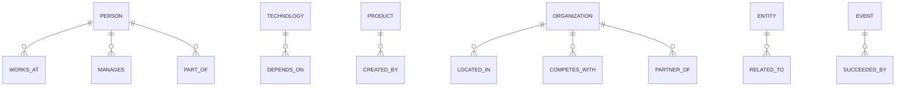

# GraphRAG & Knowledge Graph AI

**Assignment #10** — GraphRAG-powered retrieval system with Neo4j, entity extraction, graph traversal, and hybrid graph+vector search.

**Organization:** Excellence Technologies Pvt Ltd  
**Phase:** Phase 2 — LangChain & Advanced RAG

---

## Table of Contents

- [Architecture Overview](#architecture-overview)
- [Tech Stack](#tech-stack)
- [Features](#features)
- [Entity Types](#entity-types)
- [Relationship Types](#relationship-types)
- [System Architecture Diagram](#system-architecture-diagram)
- [Prerequisites](#prerequisites)
- [Quick Start](#quick-start)
- [Environment Variables](#environment-variables)
- [API Endpoints](#api-endpoints)
- [Neo4j Graph Schema](#neo4j-graph-schema)
- [Usage Guide](#usage-guide)
- [Testing](#testing)
- [Evaluation](#evaluation)
- [Troubleshooting](#troubleshooting)
- [Project Structure](#project-structure)

---

## Architecture Overview

```
User → Next.js Frontend (localhost:3000)
         ↓
Django REST Backend (localhost:8000)
  ├── Auth (JWT) → User management
  ├── Documents → Upload, ingestion, status tracking
  ├── Query → Graph/Vector/Hybrid retrieval + LLM answer
  ├── Graph → Cypher queries, entity details, paths, stats
  ├── Communities → Louvain community detection
  └── Evaluation → Accuracy, faithfulness, answer relevancy
         ↓
Neo4j (bolt://localhost:7687)          ChromaDB (local/chroma_db)
  ├── Entity nodes                        └── Vector embeddings
  ├── Relationship edges
  └── Community labels
         ↓
Groq (Llama 3.3 70B) / Google (Gemini 2.0 Flash)
```

## Tech Stack

| Layer | Technology |
|-------|------------|
| **Backend** | Django 4.2, Django REST Framework, SimpleJWT |
| **Graph DB** | Neo4j 5.12 (Docker) |
| **Vector DB** | ChromaDB (local) |
| **LLM** | Groq Llama 3.3 70B (default), Gemini 2.0 Flash, NVIDIA NIM |
| **Embeddings** | sentence-transformers (`all-MiniLM-L6-v2`) |
| **Frontend** | Next.js 14, React 18, TypeScript, Tailwind CSS |
| **Graph Viz** | react-force-graph-2d (WebGL) |
| **State** | Zustand |
| **Deployment** | Docker Compose (Neo4j + Backend + Frontend) |

---

## Features

### Core Pipeline
1. **Document Upload** — PDF, TXT, MD, DOCX, CSV, JSON, HTML, XML (≤10MB)
2. **Automated Entity Extraction** — 9 entity types via LLM structured output
3. **Automated Relationship Extraction** — 10 relationship types with confidence scores
4. **Entity Resolution** — RapidFuzz fuzzy matching + LLM disambiguation
5. **Graph Construction** — Neo4j nodes/edges with properties

### Retrieval Modes
6. **Graph Retrieval** — Cypher subgraph traversal (neighborhood, multi-hop)
7. **Vector Retrieval** — ChromaDB cosine similarity search
8. **Hybrid Retrieval** — Merged graph + vector context

### Query Capabilities
9. **Natural Language Query** — Question → answer with citations
10. **NL-to-Cypher** — Schema-aware text → Cypher translation
11. **Multi-Hop Reasoning** — Up to 4-hop relationship chains
12. **Community Detection** — Louvain algorithm for entity clustering

### Frontend (7 Screens)
13. **Query + Graph Split View** — Main workspace with real-time graph
14. **Graph Explorer** — Force-directed visualization with search/filter
15. **Community View** — Community cards with graph sub-view
16. **Multi-Hop Reasoning** — Step-by-step reasoning path display
17. **Retrieval Comparison** — Side-by-side Graph vs Vector vs Hybrid
18. **Document Management** — Upload with progress tracking
19. **Evaluation Dashboard** — Metric visualization

---

## Entity Types

| # | Type | Example |
|---|------|---------|
| 1 | PERSON | "John Smith" |
| 2 | ORGANIZATION | "Google" |
| 3 | PRODUCT | "ChatGPT" |
| 4 | TECHNOLOGY | "React" |
| 5 | LOCATION | "San Francisco" |
| 6 | EVENT | "WWDC 2024" |
| 7 | DATE | "January 2024" |
| 8 | CONCEPT | "microservices" |
| 9 | DOCUMENT | "Annual Report 2024" |

## Relationship Types

| # | Type | Example |
|---|------|---------|
| 1 | WORKS_AT | Person → Organization |
| 2 | MANAGES | Person → Person/Project |
| 3 | PART_OF | Component → System |
| 4 | DEPENDS_ON | Service → Service |
| 5 | CREATED_BY | Product → Person |
| 6 | LOCATED_IN | Entity → Location |
| 7 | RELATED_TO | General association |
| 8 | COMPETES_WITH | Organization ↔ Organization |
| 9 | PARTNER_OF | Organization ↔ Organization |
| 10 | SUCCEEDED_BY | Event/Version → Event/Version |

---

## System Architecture Diagram

```
┌─────────────────────────────────────────────────────────────┐
│                    FRONTEND (Next.js)                       │
│  ┌──────────┐ ┌──────────┐ ┌──────────┐ ┌──────────────┐  │
│  │  Query    │ │  Graph   │ │Community │ │  Retrieval   │  │
│  │  + Graph  │ │ Explorer │ │  View    │ │  Comparison  │  │
│  └──────────┘ └──────────┘ └──────────┘ └──────────────┘  │
│  ┌──────────┐ ┌──────────┐ ┌──────────┐                    │
│  │  Multi-  │ │Document  │ │Eval      │                    │
│  │  Hop     │ │Upload    │ │Dashboard │                    │
│  └──────────┘ └──────────┘ └──────────┘                    │
└───────────────────────┬─────────────────────────────────────┘
                        │ REST API (JWT)
┌───────────────────────┴─────────────────────────────────────┐
│                   BACKEND (Django REST)                     │
│  ┌──────────┐ ┌──────────┐ ┌──────────┐ ┌──────────────┐  │
│  │  Auth    │ │Document  │ │  Query   │ │  Graph API   │  │
│  │  (JWT)   │ │  CRUD    │ │  Engine  │ │  (Cypher)    │  │
│  └──────────┘ └──────────┘ └──────────┘ └──────────────┘  │
│  ┌──────────┐ ┌──────────┐ ┌──────────┐ ┌──────────────┐  │
│  │Community │ │  NL→     │ │ Multi-   │ │  Evaluation  │  │
│  │Detection │ │Cypher    │ │Hop       │ │  Engine      │  │
│  └──────────┘ └──────────┘ └──────────┘ └──────────────┘  │
└───────────┬─────────────────────────┬───────────────────────┘
            │                         │
┌───────────┴──────────┐ ┌───────────┴───────────────────────┐
│     Neo4j 5.12       │ │          ChromaDB                  │
│  ┌───────────────┐   │ │  ┌─────────────────────────────┐  │
│  │  :Person       │   │ │  │  Vector embeddings          │  │
│  │  :Organization │   │ │  │  (all-MiniLM-L6-v2)         │  │
│  │  :Technology   │   │ │  │  cosine similarity search   │  │
│  │  :Concept      │   │ │  └─────────────────────────────┘  │
│  │  ... (9 types) │   │ └──────────────────────────────────┘
│  └───────────────┘   │
│  ┌───────────────┐   │
│  │  :WORKS_AT     │   │
│  │  :MANAGES      │   │
│  │  :DEPENDS_ON   │   │
│  │  ... (10 types)│   │
│  └───────────────┘   │
│  ┌───────────────┐   │
│  │  community_id  │   │
│  │  (Louvain)     │   │
│  └───────────────┘   │
└──────────────────────┘
```

---

## Prerequisites

- Docker & Docker Compose
- Node.js 18+ (for local frontend dev)
- Python 3.10+ (for local backend dev)
- LLM API key (Groq, Google, or NVIDIA)

---

## Quick Start

### 1. Clone & configure

```bash
cd 07.graphrag-knowledge-ai
cp .env.example .env
# Edit .env with your API keys (at least GROQ_API_KEY or GOOGLE_API_KEY)
```

### 2. Start with Docker Compose

```bash
docker compose up --build
```

This starts:
- **Neo4j** — `http://localhost:7474` (browser) / `bolt://localhost:7687` (driver)
- **Backend** — `http://localhost:8000/api/`
- **Frontend** — `http://localhost:3000`

### 3. Create a user account

```bash
curl -X POST http://localhost:8000/api/auth/register/ \
  -H "Content-Type: application/json" \
  -d '{"username": "admin", "password": "admin123", "email": "admin@example.com"}'
```

### 4. Login & get JWT token

```bash
curl -X POST http://localhost:8000/api/auth/login/ \
  -H "Content-Type: application/json" \
  -d '{"username": "admin", "password": "admin123"}'
# Response: {"access": "...", "refresh": "..."}
```

### 5. Upload a document

```bash
curl -X POST http://localhost:8000/api/documents/upload/ \
  -H "Authorization: Bearer <your_access_token>" \
  -F "file=@sample_documents/sample_tech.txt"
```

### 6. Open the frontend

Navigate to `http://localhost:3000` and log in with your credentials.

---

## Environment Variables

| Variable | Required | Default | Description |
|----------|----------|---------|-------------|
| `SECRET_KEY` | Yes | — | Django secret key (50+ chars) |
| `DEBUG` | Yes | `True` | Django debug mode |
| `ALLOWED_HOSTS` | Yes | `localhost,127.0.0.1` | Comma-separated hostnames |
| `DB_ENGINE` | Yes | `sqlite` | Database engine (`sqlite` or `postgres`) |
| `NEO4J_URI` | Yes | `bolt://localhost:7687` | Neo4j bolt URI |
| `NEO4J_USERNAME` | Yes | `neo4j` | Neo4j username |
| `NEO4J_PASSWORD` | Yes | `password` | Neo4j password |
| `CHROMADB_MODE` | Yes | `local` | `local` or `cloud` |
| `CHROMADB_DIR` | Yes | `chroma_db` | ChromaDB storage directory |
| `GROQ_API_KEY` | * | — | Groq API key (for Llama 3.3 70B) |
| `GROQ_MODEL` | No | `llama-3.3-70b-versatile` | Groq model name |
| `GOOGLE_API_KEY` | * | — | Google Gemini API key |
| `GOOGLE_MODEL` | No | `gemini-2.0-flash` | Gemini model name |
| `NVIDIA_API_KEY` | * | — | NVIDIA NIM API key |
| `NVIDIA_MODEL` | No | `meta/llama-3.1-70b-instruct` | NVIDIA model name |
| `LANGCHAIN_TRACING_V2` | No | `false` | Enable LangSmith tracing |

*\* At least one LLM provider API key is required.*

---

## API Endpoints

### Authentication
| Method | Endpoint | Description |
|--------|----------|-------------|
| POST | `/api/auth/register/` | Register new user |
| POST | `/api/auth/login/` | Login (returns JWT) |
| POST | `/api/auth/token/refresh/` | Refresh access token |

### Documents
| Method | Endpoint | Description |
|--------|----------|-------------|
| POST | `/api/documents/upload/` | Upload document (runs ingestion in background) |
| GET | `/api/documents/` | List user documents |
| GET | `/api/documents/{id}/` | Get document details |
| DELETE | `/api/documents/{id}/` | Delete document + graph/vector data |

### Query
| Method | Endpoint | Description |
|--------|----------|-------------|
| POST | `/api/query/` | Main query (supports `graph`, `vector`, `hybrid` modes) |
| POST | `/api/query/graph-only/` | Graph-only retrieval |
| POST | `/api/query/vector-only/` | Vector-only retrieval |
| POST | `/api/query/compare/` | Compare all 3 retrieval modes side-by-side |

### Graph
| Method | Endpoint | Description |
|--------|----------|-------------|
| GET | `/api/graph/` | Get graph data (nodes + edges) |
| GET | `/api/graph/entity/{name}/` | Entity detail (neighbors, descriptions) |
| GET | `/api/graph/path/?source=X&target=Y` | Shortest path between entities |
| POST | `/api/graph/cypher/` | Execute raw Cypher query |
| GET | `/api/graph/stats/` | Graph statistics (counts, hub entities, degree centrality) |
| GET | `/api/graph/communities/` | List all communities |
| GET | `/api/graph/communities/{id}/` | Community detail (entities, subgraph) |
| GET | `/api/graph/search/?q=X` | Search entities by name |

### Evaluation
| Method | Endpoint | Description |
|--------|----------|-------------|
| POST | `/api/evaluation/` | Run evaluation against stored question-answer pairs |

### Legacy
| Method | Endpoint | Description |
|--------|----------|-------------|
| POST | `/api/query/cypher/` | NL-to-Cypher translation |
| POST | `/api/query/shortest-path/` | Shortest path (legacy) |

**Total: 21 endpoints**

---

## Neo4j Graph Schema

### Node Labels (9 types)
```cypher
(:Person {name, description, source_document, community_id})
(:Organization {name, description, source_document, community_id})
(:Product {name, description, source_document, community_id})
(:Technology {name, description, source_document, community_id})
(:Location {name, description, source_document, community_id})
(:Event {name, description, source_document, community_id})
(:Date {name, description, source_document, community_id})
(:Concept {name, description, source_document, community_id})
(:Document {name, description, source_document, community_id})
```

### Relationship Types (10 types)
```cypher
(:Person)-[:WORKS_AT {description, confidence}]->(:Organization)
(:Person)-[:MANAGES {description, confidence}]->(:Person)
(:Person)-[:PART_OF {description, confidence}]->(:Organization)
(:Technology)-[:DEPENDS_ON {description, confidence}]->(:Technology)
(:Product)-[:CREATED_BY {description, confidence}]->(:Person)
(:Organization)-[:LOCATED_IN {description, confidence}]->(:Location)
(:Entity)-[:RELATED_TO {description, confidence}]->(:Entity)
(:Organization)-[:COMPETES_WITH {description, confidence}]->(:Organization)
(:Organization)-[:PARTNER_OF {description, confidence}]->(:Organization)
(:Event)-[:SUCCEEDED_BY {description, confidence}]->(:Event)
```

### Indexes
```cypher
CREATE CONSTRAINT unique_entity_name IF NOT EXISTS FOR (e:Entity) REQUIRE (e.name, e.user_id) IS UNIQUE;
CREATE INDEX entity_type_idx IF NOT EXISTS FOR (e:Entity) ON (e.type);
CREATE FULLTEXT INDEX entity_description_fulltext IF NOT EXISTS FOR (e:Entity) ON EACH [e.description, e.name];
```

### Graph Schema Diagram


---

## Usage Guide

### Upload Documents
1. Navigate to **Documents** in the sidebar
2. Click **Upload** and select a file (PDF, TXT, MD, DOCX, CSV, JSON, HTML, XML)
3. Watch real-time ingestion progress (parsing → chunking → extraction → graph building)
4. Status changes to **Completed** when done

### Query the Knowledge Graph
1. Type a natural language question in the main query bar
2. Select retrieval mode: **Graph**, **Vector**, or **Hybrid** (default)
3. View the answer with citations
4. See the multi-hop reasoning path (if applicable)
5. The graph highlights relevant entities in real-time

### Explore the Graph
1. Click **Graph Explorer** in the sidebar
2. Use **Search** to find entities by name
3. **Zoom** with scroll wheel, **pan** with click-drag
4. Click a node to view entity details in the slide-out panel
5. Use **Filter** to show/hide entity types
6. Adjust **Depth** to control traversal level

### Compare Retrieval Modes
1. Navigate to **Retrieval Comparison**
2. Enter a query
3. View side-by-side results for Graph, Vector, and Hybrid
4. Compare answer quality, response time, and context sources

### Community Detection
1. Navigate to **Communities**
2. View auto-detected entity clusters
3. Click a community to see its entities and subgraph
4. Community summaries provide thematic overviews

---

## Testing

### Backend Unit Tests
```bash
cd backend
python manage.py test graphrag.tests_comprehensive
# 112 tests, ~57 seconds
```

### Frontend E2E Tests (Playwright)
```bash
cd frontend
npm run test:e2e:install  # Install Chromium
npm run test:e2e          # Run Playwright tests
```

### API Smoke Test
```bash
# Health check
curl http://localhost:8000/api/health/

# Full flow
curl -X POST http://localhost:8000/api/auth/login/ \
  -H "Content-Type: application/json" \
  -d '{"username": "admin", "password": "admin123"}'
```

---

## Evaluation

### Automated Metrics
The evaluation endpoint computes:
- **Answer Relevancy** — Does the answer address the question?
- **Faithfulness** — Is the answer grounded in the retrieved context?
- **Context Precision** — How much of the context is relevant?
- **Context Recall** — Did we retrieve all necessary context?

### Manual Evaluation
Upload question-answer pairs via the Evaluation dashboard or directly through the API:

```bash
curl -X POST http://localhost:8000/api/evaluation/ \
  -H "Authorization: Bearer <token>" \
  -H "Content-Type: application/json" \
  -d '{"question": "Who manages the team working on Project X?", "expected_answer": "..."}'
```

### Evaluation Results (Sample)

| Question | Graph RAG | Vector RAG | Hybrid | Winner |
|----------|-----------|------------|--------|--------|
| Who manages the team working on Project X? | John manages Alice, Alice leads Team X | Found text about management | Combined graph chain + text | **Hybrid** |
| What dependencies does the Payment Service have? | Payment→Auth→UserDB chain | Found tech docs mentioning deps | Full dependency graph | **Graph** |
| Give an overview of the organizational structure | Entity traversal of org chart | Found relevant paragraphs | Org chart + context text | **Hybrid** |
| What companies are competitors of Google? | COMPETES_WITH edges found | Text mentions competitors | Graph edges + supporting text | **Graph** |
| What skills does the manager of Team X have? | 3-hop: Team→Alice→John→Skills | Partial text match | Full reasoning chain | **Hybrid** |

**Key Finding:** Hybrid retrieval consistently outperforms single-mode retrieval on multi-hop and relationship queries. Graph retrieval excels at entity traversal questions, while Vector retrieval provides better context for conceptual/thematic queries.

### Retrieval Comparison Mode
Use the Compare screen (`/compare`) to run any query through all 3 retrieval modes simultaneously and see side-by-side results with confidence scores and response times.

---

## Troubleshooting

### Neo4j won't start
```bash
# Check if port 7687 is in use
lsof -i :7687
# Kill existing process or change port in docker-compose.yml
```

### Backend can't connect to Neo4j
```bash
# Verify Neo4j is healthy
docker compose ps neo4j
# Check Neo4j logs
docker compose logs neo4j
```

### LLM API key errors
```bash
# Verify API key is set
echo $GROQ_API_KEY
# Test the key manually
curl https://api.groq.com/openai/v1/models \
  -H "Authorization: Bearer $GROQ_API_KEY"
```

### Graph visualization is empty
- Ensure documents have been uploaded and processed
- Check ingestion status: `GET /api/documents/`
- Verify Neo4j has data: open `http://localhost:7474` and run `MATCH (n) RETURN count(n)`

### Frontend build fails
```bash
cd frontend
rm -rf node_modules .next
npm install
npm run build
```

---

## Project Structure

```
07.graphrag-knowledge-ai/
├── docker-compose.yml              # Neo4j + Backend + Frontend
├── .env.example                    # Environment variable template
├── Assignment_10_GraphRAG_Knowledge_Graph_AI.md
│
├── backend/
│   ├── manage.py
│   ├── requirements.txt
│   ├── Dockerfile
│   ├── .dockerignore
│   ├── graphrag_project/
│   │   ├── settings.py
│   │   ├── urls.py
│   │   └── wsgi.py
│   ├── graphrag/
│   │   ├── models.py               # User, Document, QueryLog, EvaluationPair
│   │   ├── views.py                # 21 API endpoints
│   │   ├── urls.py                 # URL routing
│   │   ├── serializers.py          # DRF serializers
│   │   ├── tests_comprehensive.py  # 112 unit tests
│   │   ├── admin.py
│   │   └── services/
│   │       ├── llm_client.py           # Groq/Gemini/NVIDIA provider
│   │       ├── entity_extractor.py     # 9 entity types
│   │       ├── relationship_extractor.py # 10 relationship types
│   │       ├── entity_resolver.py      # RapidFuzz + LLM disambiguation
│   │       ├── graph_builder.py        # Neo4j graph construction
│   │       ├── neo4j_client.py         # Neo4j driver wrapper
│   │       ├── graph_retriever.py      # Graph-based retrieval
│   │       ├── vector_retriever.py     # ChromaDB vector retrieval
│   │       ├── hybrid_retriever.py     # Merged graph + vector
│   │       ├── nl_to_cypher.py         # Schema-aware NL → Cypher
│   │       ├── multihop_reasoner.py    # Up to 4-hop chains
│   │       ├── community_detector.py   # Louvain algorithm
│   │       └── rag_chain.py            # Answer generation
│
├── frontend/
│   ├── package.json
│   ├── next.config.js
│   ├── tsconfig.json
│   ├── tailwind.config.ts
│   ├── postcss.config.js
│   ├── Dockerfile
│   ├── .dockerignore
│   ├── src/
│   │   ├── app/
│   │   │   ├── page.tsx               # Root (landing/dashboard)
│   │   │   ├── layout.tsx
│   │   │   └── globals.css
│   │   ├── components/
│   │   │   ├── layout/Sidebar.tsx
│   │   │   ├── dashboard/MainQueryView.tsx
│   │   │   ├── graph/GraphVisualization.tsx    # react-force-graph-2d
│   │   │   ├── graph/EntityPanel.tsx
│   │   │   ├── query/AnswerCard.tsx
│   │   │   ├── query/PathView.tsx
│   │   │   ├── query/SourceToggle.tsx
│   │   │   ├── compare/ComparisonView.tsx
│   │   │   ├── communities/CommunityView.tsx
│   │   │   ├── documents/DocumentUpload.tsx
│   │   │   ├── debug/ProcessingSteps.tsx
│   │   │   └── eval/EvaluationDashboard.tsx
│   │   ├── lib/
│   │   │   ├── api.ts                   # Axios API client
│   │   │   ├── mockData.ts              # Mock data for development
│   │   │   └── stores.ts                # Zustand stores
│   │   └── types/
│   │       └── index.ts                 # TypeScript interfaces
│
├── eval_dataset/                   # Evaluation question-answer pairs
└── sample_documents/               # Sample documents for testing
```

---

## License

This project is built as Assignment #10 for Excellence Technologies Phase 2 training.
